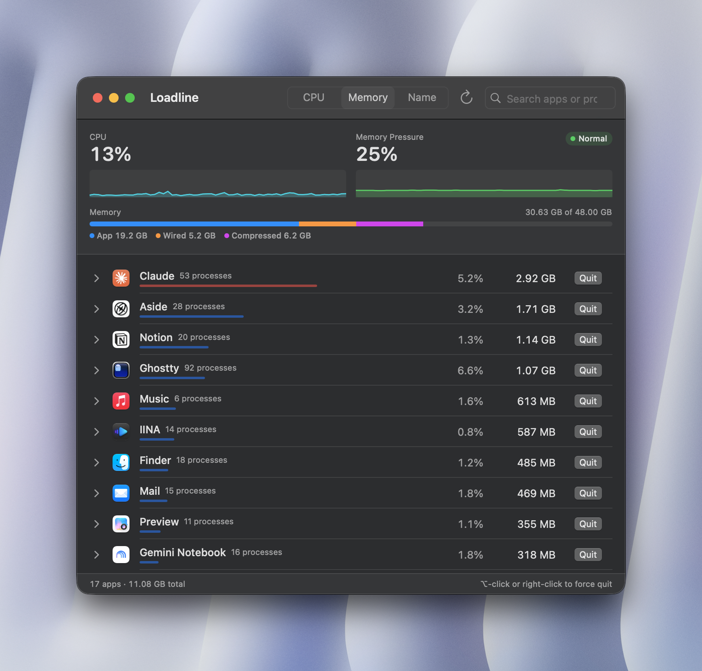
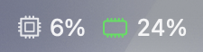
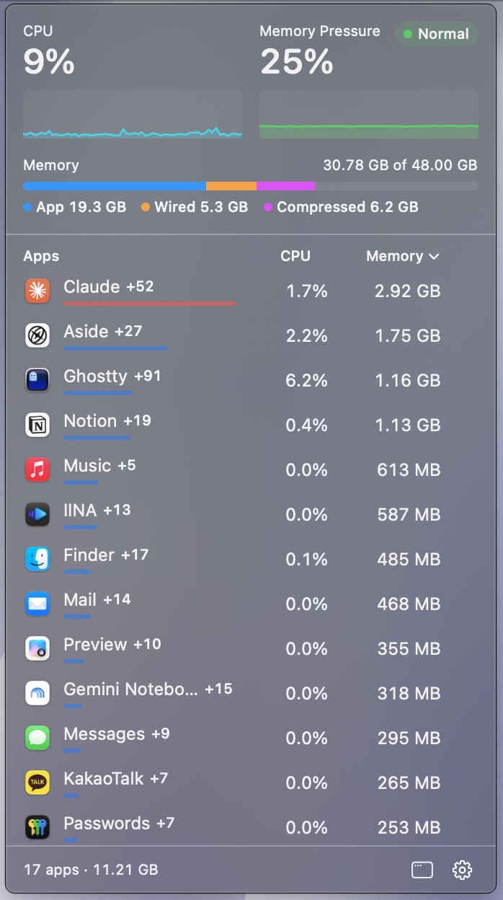

# Loadline

A macOS menu bar app that shows which apps are using your CPU and memory, and lets you quit them in one click.

Loadline groups each app's helper processes (Safari's WebContent processes, Electron renderers, XPC services, and so on) under the app itself, so the numbers reflect what an app really costs — the same way Activity Monitor attributes them.

<p align="center">
  
</p>

## Download

**[Download the latest release](https://github.com/eastLight210/Loadline/releases/latest)** (macOS 15 or later, Apple Silicon and Intel)

Open the DMG and drag Loadline to Applications. The app is signed with a Developer ID and notarized by Apple.

## Features

**Menu bar**



- Live system CPU and memory pressure, with tinted icons for pressure level
- Choose what the menu bar shows: CPU + Pressure, Memory Pressure, Memory Used, CPU Usage, or Icon Only

**Popover**



- CPU and memory-pressure history graphs, plus a memory breakdown (App / Wired / Compressed / Swap)
- Running apps with per-app CPU and memory, sortable by either column
- Hover a row to quit the app; hold <kbd>⌥</kbd> to force quit

**Details window**
- Search across apps and their processes
- Expand an app to see every process it owns, with PID, CPU, and memory
- End individual helper processes (SIGTERM, or SIGKILL with <kbd>⌥</kbd>)
- Right-click an app to switch to it, show it in Finder, quit, or force quit

**Settings** (gear menu in the popover)
- Include menu bar (accessory) apps
- Refresh interval: 1, 3, 5, or 10 seconds
- Launch at login

## Requirements

- macOS 15 (Sequoia) or later
- Swift 6 toolchain (Xcode 16 or later) to build

## Build

```sh
./build.sh            # release build → build/Loadline.app
./build.sh debug      # debug build
./build.sh release --run   # build, then relaunch the app
```

The script builds with SwiftPM, assembles `build/Loadline.app`, and signs it ad hoc. Copy the app to `/Applications` to keep it around; "Launch at Login" works best from there.

To build a signed, notarized DMG (requires a Developer ID certificate and a `notarytool` keychain profile, see the top of the script):

```sh
./release.sh             # → build/Loadline-<version>.dmg
./release.sh --publish   # also create a GitHub release for v<version>
```

## How the numbers are measured

| Metric | Source | Matches Activity Monitor's |
| --- | --- | --- |
| App memory | Physical footprint (`proc_pid_rusage`) summed over the app's processes | Memory column |
| App CPU | CPU time delta between samples; 100% = one full core | % CPU column |
| System CPU | `host_statistics` CPU load ticks | CPU graph |
| Memory used | App + Wired + Compressed (`host_statistics64`) | Memory Used |
| Memory pressure | `kern.memorystatus_level` / `kern.memorystatus_vm_pressure_level` | Memory Pressure graph |

Helper processes are attributed to their app through the "responsible process" relationship (the private `responsibility_get_pid_responsible_for_pid` call Activity Monitor uses), falling back to the parent-process chain. Only processes owned by the current user are sampled.

## Project layout

```
Sources/Loadline/
├── LoadlineApp.swift     # App entry, menu bar label
├── AppMonitor.swift      # Sampling loop, app state, quit actions, settings keys
├── ProcessSampler.swift  # libproc / Mach sampling of processes, CPU, and memory
├── MenuBarView.swift     # Popover UI
├── MainWindowView.swift  # Details window
└── SharedViews.swift     # System summary, graphs, bars
```
